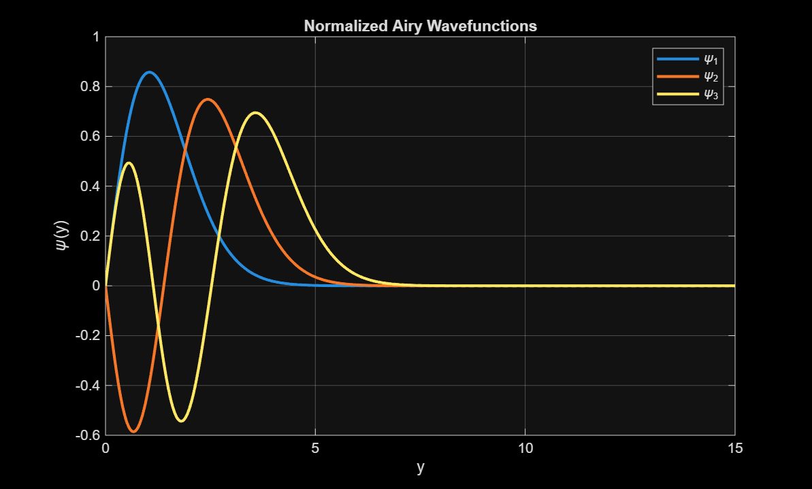
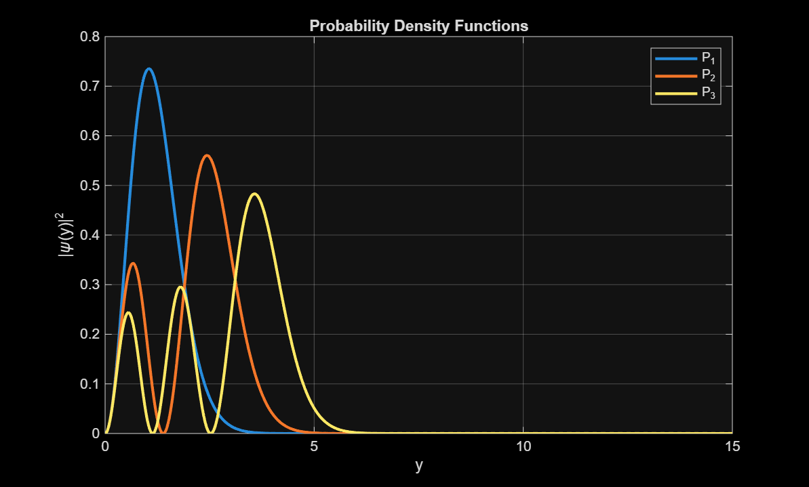

# ⚛️ Quantum Vertical Motion Simulation

## Overview

The **Quantum Vertical Motion Simulation** is a MATLAB-based scientific computing project that models the motion of a quantum particle under the influence of a gravitational potential using numerical methods.

The project explores fundamental concepts of quantum mechanics, including wavefunctions, probability densities, quantized energy states, and particle behavior in confined systems. Computational techniques are employed to solve and visualize the quantum system, providing insights into the relationship between mathematical models and physical phenomena.

This project demonstrates the application of **Scientific Computing**, **Numerical Methods**, **Quantum Mechanics**, and **Mathematical Modelling** using MATLAB.

---

## Objectives

* Simulate quantum particle motion using computational methods.
* Analyze wavefunction behavior and probability distributions.
* Investigate quantized energy levels.
* Visualize quantum states through graphical representations.
* Apply numerical techniques to solve physics-based problems.

---

## Features

✅ MATLAB-Based Simulation

✅ Numerical Solution of Quantum Systems

✅ Wavefunction Analysis

✅ Probability Density Visualization

✅ Quantized Energy State Computation

✅ Scientific Data Visualization

✅ Computational Physics Applications

✅ Mathematical Modelling of Quantum Systems

---

## Scientific Background

Quantum systems cannot generally be solved analytically for all scenarios. Numerical methods provide an effective way to approximate solutions and analyze particle behavior.

This simulation focuses on:

* Quantum Particle Motion
* Wavefunction Evolution
* Probability Density Functions
* Energy Eigenstates
* Computational Modelling Techniques

The project bridges concepts from:

* Quantum Mechanics
* Linear Algebra
* Differential Equations
* Numerical Analysis
* Scientific Computing

---

## Methodology

The simulation follows these key steps:

1. Define the physical system and governing equations.
2. Discretize the problem using numerical techniques.
3. Compute energy eigenvalues and corresponding eigenstates.
4. Generate wavefunctions for the quantum particle.
5. Calculate probability densities.
6. Visualize system behavior through graphical outputs.
7. Analyze physical interpretations of the results.

---

## Technologies Used

### Programming Language

* MATLAB

### Concepts Applied

* Quantum Mechanics
* Numerical Methods
* Linear Algebra
* Differential Equations
* Scientific Visualization
* Computational Physics

---

## Project Structure

```text
quantum-vertical-motion-simulation/
│
├── README.md
├── LICENSE
│
├── report/
│   └── Quantum_Vertical_Motion_Simulation_Report.pdf
│
└── images/
    ├── wavefunction.png
    └── probability_density.png
```

---

## Simulation Results

### Wavefunction Visualization



### Probability Density Distribution



---

## Project Report

A detailed report containing:

* Theoretical Background
* Mathematical Formulation
* Numerical Methodology
* MATLAB Implementation
* Simulation Results
* Discussion and Analysis

is available below:

📄 **[View Full Project Report](report/Quantum_Vertical_Motion_Simulation_Report.pdf)**

---

## Applications

This project demonstrates concepts relevant to:

* Quantum Computing Foundations
* Computational Physics
* Scientific Computing
* Numerical Simulation
* Engineering Mathematics
* Physics Education and Research

---

## Learning Outcomes

Through this project, the following skills were developed:

* Scientific Computing with MATLAB
* Numerical Problem Solving
* Quantum System Modelling
* Mathematical Analysis
* Data Visualization
* Computational Research Techniques

---

## Future Improvements

* Time-Dependent Quantum Simulations
* Multi-Particle Quantum Systems
* Higher-Dimensional Models
* Interactive Visualization Dashboard
* Python-Based Implementation
* Advanced Numerical Solvers

---

## Author

### Soumy Mittal

B.Tech Artificial Intelligence & Data Science
Amrita Vishwa Vidyapeetham

### Research Interests

* Scientific Computing
* Machine Learning
* Computational Modelling
* Quantum Systems
* Data-Driven Engineering
* Intelligent Systems

---

## License

This project is licensed under the MIT License.
